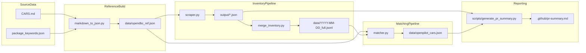

# Data Pipeline

Single source of truth for how data moves through this repo.

## At A Glance



ASCII flow (for quick copy/paste views, end-to-end):

```text
┌─────────────┐         ┌──────────────────────┐
│ CARS.md     │         │ package_keywords.json│
└──────┬──────┘         └──────────┬───────────┘
       │                           │
       └──────────────┬────────────┘
                      ▼
            ┌─────────────────────┐
            │ markdown_to_json.py │
            └──────────┬──────────┘
                       ▼
            ┌─────────────────────────┐
            │ data/opendbc_ref.json   │
            └──────────┬──────────────┘
                   │
                   ├──────────────►┌─────────────┐
                   │               │ scraper.py  │
                   │               └──────┬──────┘
                   │                      ▼
                   │               ┌─────────────────────┐
                   │               │ output/*.json       │
                   │               └──────┬──────────────┘
                   │                      ▼
                   │               ┌─────────────────────┐
                   │               │ merge_inventory.py  │
                   │               └──────┬──────────────┘
                   │                      ▼
                   │               ┌─────────────────────┐
                   └──────────────►│ data/*_full.jsonl   │
                                   └──────┬──────────────┘
                                          ▼
                                  ┌─────────────┐
                                  │ matcher.py  │◄──── data/opendbc_ref.json
                                  └──────┬──────┘
                                         ▼
                                  ┌─────────────────────┐
                                  │ data/openpilot_     │
                                  │ cars.json           │
                                  └──────┬──────────────┘
                                         ▼
                                  ┌─────────────────────┐
                                  │ generate_pr_summary │◄──── output/*.json
                                  │ .py                 │
                                  └──────┬──────────────┘
                                         ▼
                                  ┌─────────────────────┐
                                  │ .github/pr-summary. │
                                  │ md                  │
                                  └─────────────────────┘
```

## Plain-Text Pipeline Overview

Use this when you want a fast scan without diagrams:

1. `markdown_to_json.py` converts `CARS.md` + `package_keywords.json` into trusted reference data.
2. `scraper.py` uses reference makes to scrape CarMax API into `output/<Make>.json`.
3. `merge_inventory.py` merges per-make files into `data/YYYY-MM-DD_full.jsonl`.
4. `matcher.py` joins JSONL inventory with reference data and writes `data/openpilot_cars.json`.
5. `scripts/generate_pr_summary.py` builds `.github/pr-summary.md` with scrape counts + matcher metrics.

## Pipeline Boundaries

- `markdown_to_json.py` validates package keyword schema and produces trusted reference data.
- `scraper.py` fetches inventory for makes in reference data.
- `merge_inventory.py` flattens per-make JSON into one JSONL stream.
- `matcher.py` consumes trusted reference + JSONL and writes match results + metrics.
- `generate_pr_summary.py` reads scraper outputs and matcher metrics for PR body text.

## Canonical Artifacts

- `output/*.json` is the raw per-make scrape output.
- `data/*_full.jsonl` is the canonical matcher input.
- `data/openpilot_cars.json` is the canonical product output consumed downstream.

## Workflow States

- `healthy`: raw scrape output exists, the canonical matcher input was produced, and the canonical product output was produced.
- `degraded`: one or more canonical artifacts are missing, so the run should be treated as review-only rather than publishable output.

## Naming Conventions

- `reference` is the canonical term in code and docs (not `supported`).
- Reason: reference data includes all confidence levels (`extra_high`, `high`, `medium`, `low`, `non_us`), so `supported` is too narrow.
- Canonical reference artifact is `data/opendbc_ref.json`.
- This file is generated by `markdown_to_json.py` from `CARS.md` + `package_keywords.json`.

## Stage 1: Build Reference Data

Run:

```bash
python3 markdown_to_json.py
```

Input:
- `CARS.md`
- `package_keywords.json`

Output:
- `data/opendbc_ref.json`

Important semantics from `package_keywords.json`:
- `keywords: null` means no keyword verification (only valid for `extra_high` and `non_us`)
- `keywords: ["-"]` means temporary placeholder (treated as auto-pass in matcher)
- `keywords: []` is invalid and rejected during validation

## Stage 2: Scrape Inventory

Run:

```bash
python3 scraper.py
```

Input:
- `data/opendbc_ref.json` (`stats.total_by_make` drives what gets scraped)
- cookies from env vars (`ABCK_COOKIE`, `KMXVISITOR_COOKIE`) or `cookies.json`

Output:
- `output/<Make>.json` per make

Notes:
- Supports partial success: one make can fail while others are still saved.
- `total_count: 0` is valid (not an error).
- API default behavior can be partial inventory if cookies are missing/invalid.

## Stage 3: Merge Inventory

Run:

```bash
python3 merge_inventory.py
```

Output:
- `data/YYYY-MM-DD_full.jsonl`

Why JSONL:
- stream-friendly for matcher
- easy diagnostics with line-based tools

## Stage 4: Match Cars

Run:

```bash
python3 matcher.py
# or
python3 matcher.py --dry-run
python3 matcher.py --input data/custom.jsonl
```

Inputs:
- `data/opendbc_ref.json`
- latest `data/*_full.jsonl` (or `--input`)

Output:
- `data/openpilot_cars.json`

### Match Logic

1. Normalize make/model into `index_key`.
2. Lookup candidate reference entries by `index_key`. The reference index excludes all `non_us` entries — they are never matched against inventory.
3. Filter by year.
4. Verify keywords (AND logic) unless bypassed by `null` or `["-"]`. A keyword miss produces **no match** — confidence is not downgraded; the car is simply skipped.
5. Track cheapest car per `(variant, year)` by:
   - lower `basePrice`
   - then lower `mileage` as tie-breaker

### Confidence and Keyword Rules

`matcher.py` treats keywords as:
- `None`: match without feature checks
- `["-"]`: match without feature checks (placeholder)
- list of real keywords: all keywords must appear in combined feature text — if any keyword is missing, the car is **not matched** (no downgrade to a lower confidence)

`MatchConfidence` values:
- `extra_high`
- `high`
- `medium`
- `low`
- `non_us` — entries with this confidence are excluded from the reference index. They still appear in `openpilot_cars.json` as entries, but `available_years` will always be empty and all years will be in `unavailable_years`

### Current Output Shape

Each entry contains:
- `make`, `model`, `model_original`
- `package_requirements`, `package_key_used`
- `matching_keywords`, `variant_info`, `support_level`
- `available_years`: list of `{year, match_confidence, car}`
- `unavailable_years`: list of year integers

Top-level fields include:
- `entries`
- `warnings`
- `generated_at`
- `pipeline_metrics`

Example metrics block:

```json
{
  "pipeline_metrics": {
    "total_lines": 69862,
    "cars_processed": 69862,
    "json_parse_errors": 0,
    "matches_found": 23275,
    "match_rate": 0.3332,
    "no_match_breakdown": {
      "unsupported_models": 25993,
      "year_mismatch": 14623,
      "keyword_mismatch": 6427
    }
  }
}
```

`no_match_breakdown` buckets:
- `unsupported_models`: no reference entries for the normalized make/model
- `year_mismatch`: make/model exists, but no entry contains car year
- `keyword_mismatch`: year matched, but required keywords failed
- `missing_make_or_model`: inventory item missing required identity fields

## CI Pipeline (Current)

The scheduled GitHub Actions workflow runs:
1. `scraper.py`
2. `merge_inventory.py`
3. `matcher.py`
4. `scripts/generate_pr_summary.py`
5. create PR with updated outputs

See `md/OPERATIONS.md` for runbooks, cookies, and troubleshooting.
